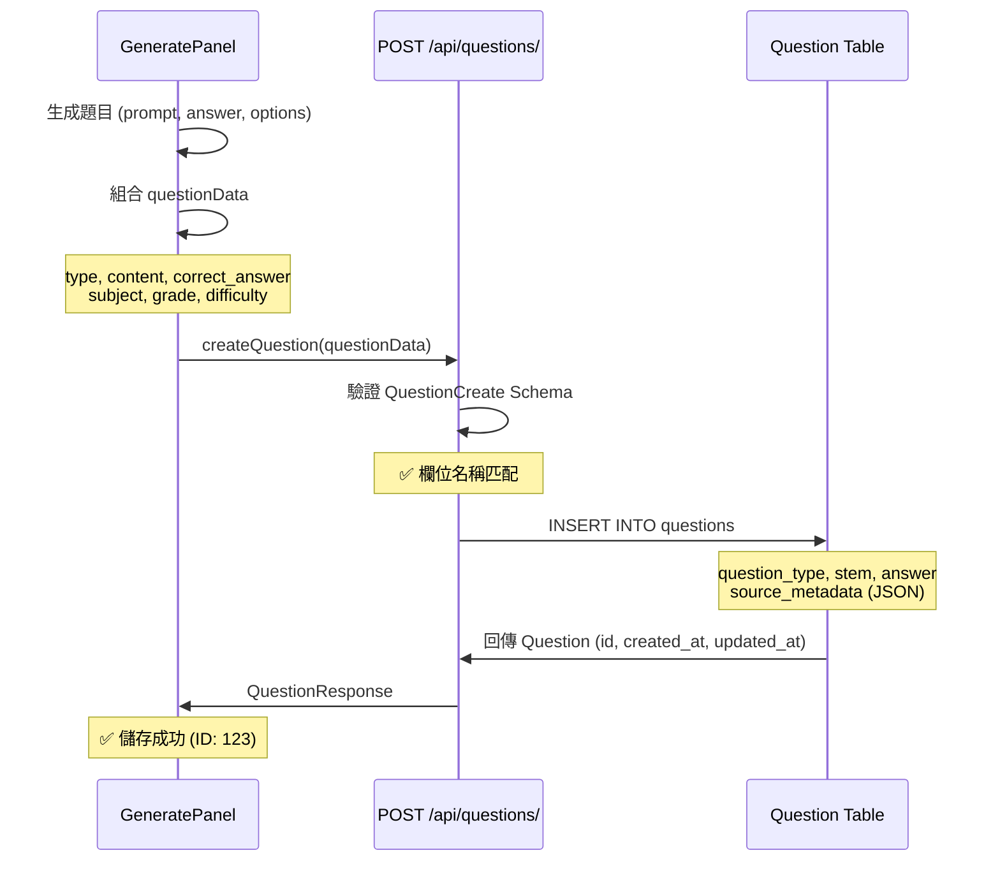
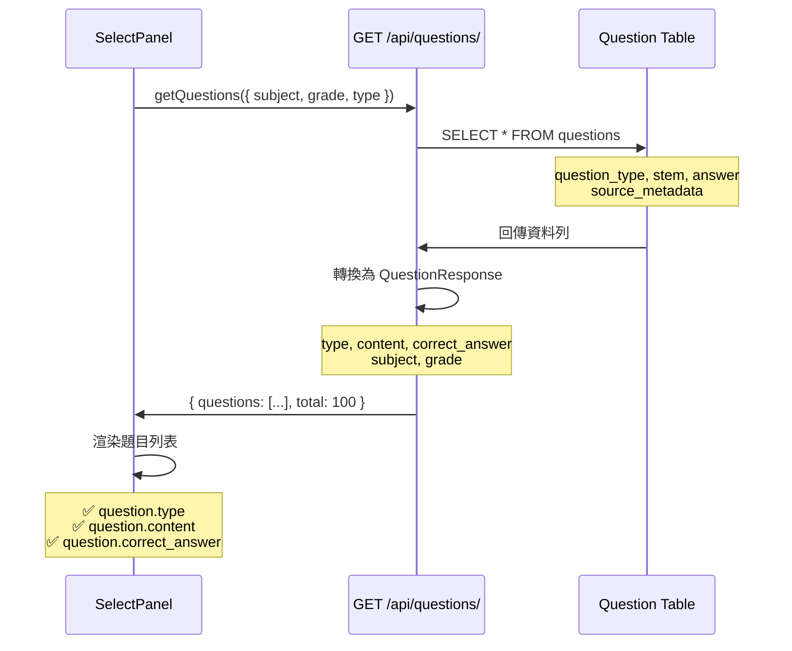

# Phase A 修復總結：題目列表顯示問題

**修復日期**: 2025-10-12
**狀態**: ✅ 已完成並通過構建測試

---

## 🔍 問題診斷結果

### 問題 1: `generate.undefined` 顯示錯誤 ❌
**根本原因**: 前後端欄位名稱不一致

**問題鏈路**:
```
資料庫模型 (Question)
  ↓ question_type (Column 名稱)
QuestionResponse Schema
  ↓ type (API 回應欄位)
前端 SelectPanel
  ↓ question.question_type (錯誤！應該是 question.type)
翻譯函數
  ↓ t(`generate.undefined`) ❌
```

### 問題 2: 缺少 `updated_at` 欄位 ❌
**根本原因**: Question 模型缺少 `updated_at` 時間戳

```python
# 原始狀態
created_at = Column(TIMESTAMP(timezone=True), server_default=func.now())
# 缺少 updated_at！

# QuestionResponse Schema 卻要求
updated_at: datetime  # ❌ Validation Error
```

### 問題 3: AI 生成儲存欄位映射錯誤 ❌
**根本原因**: GeneratePanel 使用前端欄位名，與後端 API 不匹配

| 前端儲存 (錯誤) | 後端 Schema | 資料庫模型 |
|---|---|---|
| `prompt` ❌ | `content` ✅ | `stem` |
| `question_type` ❌ | `type` ✅ | `question_type` |
| `answer` ❌ | `correct_answer` ✅ | `answer` |

---

## ✅ Phase A 修復內容

### A1. 添加 Question 模型 `updated_at` 欄位

**檔案**: [backend/app/db/models.py](backend/app/db/models.py:99-100)

```python
# Line 99-100
created_at = Column(TIMESTAMP(timezone=True), server_default=func.now())
updated_at = Column(TIMESTAMP(timezone=True), server_default=func.now(), onupdate=func.now())
```

**效果**:
- ✅ 符合 QuestionResponse Schema 要求
- ✅ 自動追蹤題目更新時間
- ✅ 與其他模型 (Document, Template) 保持一致

---

### A2. 統一 GeneratePanel 儲存欄位名

**檔案**: [frontend/src/components/ExamPaper/GeneratePanel.vue](frontend/src/components/ExamPaper/GeneratePanel.vue:324-336)

**修改前** ❌:
```javascript
const questionData = {
  prompt: question.prompt,              // ❌ 後端不認識
  question_type: questionType,          // ❌ 後端要 'type'
  answer: question.answer,              // ❌ 後端要 'correct_answer'
  tags: question.tags,                  // ❌ Schema 不支援
  metadata: { ... }                     // ❌ Schema 不支援
}
```

**修改後** ✅:
```javascript
const questionData = {
  type: questionType,                   // ✅ 對應 QuestionCreate.type
  content: question.prompt,             // ✅ 對應 QuestionCreate.content
  correct_answer: typeof question.answer === 'object'
    ? JSON.stringify(question.answer)
    : String(question.answer),          // ✅ 對應 QuestionCreate.correct_answer
  options: question.options || null,
  explanation: question.explanation || '',
  subject: props.examInfo.subject,
  grade: props.examInfo.grade,
  difficulty: 'medium'
  // 移除不支援的 tags 和 metadata
}
```

**效果**:
- ✅ AI 生成的題目能正確儲存到資料庫
- ✅ 欄位映射完全符合 QuestionCreate Schema
- ✅ 避免 422 Validation Error

---

### A3. 修復 SelectPanel 讀取欄位邏輯

**檔案**: [frontend/src/components/ExamPaper/SelectPanel.vue](frontend/src/components/ExamPaper/SelectPanel.vue)

#### 修復 3.1: 題型標籤顯示 (Line 141)

**修改前** ❌:
```vue
<span class="meta-badge type">{{ t(`generate.${question.question_type}`) }}</span>
<!-- question.question_type 為 undefined！-->
```

**修改後** ✅:
```vue
<span class="meta-badge type">{{ t(`generate.${question.type}`) }}</span>
<!-- 使用後端回傳的 'type' 欄位 -->
```

#### 修復 3.2: 題目內容顯示 (Line 147)

**修改前** ❌:
```vue
<div class="question-prompt">{{ question.prompt }}</div>
<!-- question.prompt 不存在！後端回傳的是 'content' -->
```

**修改後** ✅:
```vue
<div class="question-prompt">{{ question.content }}</div>
<!-- 使用後端回傳的 'content' 欄位 -->
```

#### 修復 3.3: 答案顯示 (Line 159-160)

**修改前** ❌:
```vue
<div v-if="question.answer" class="question-answer">
  <strong>答案：</strong>{{ formatAnswer(question.answer) }}
</div>
```

**修改後** ✅:
```vue
<div v-if="question.correct_answer" class="question-answer">
  <strong>答案：</strong>{{ formatAnswer(question.correct_answer) }}
</div>
```

#### 修復 3.4: 題型統計計算 (Line 287)

**修改前** ❌:
```javascript
const typeStats = computed(() => {
  const stats = {}
  selectedQuestions.value.forEach(q => {
    const type = q.question_type || q.type  // ❌ 混淆的 fallback
    if (type) {
      stats[type] = (stats[type] || 0) + 1
    }
  })
  return stats
})
```

**修改後** ✅:
```javascript
const typeStats = computed(() => {
  const stats = {}
  selectedQuestions.value.forEach(q => {
    const type = q.type  // ✅ 統一使用 'type' 欄位
    if (type) {
      stats[type] = (stats[type] || 0) + 1
    }
  })
  return stats
})
```

**效果**:
- ✅ 題型正確顯示（單選題、填充題、是非題...）
- ✅ 題目內容正確顯示
- ✅ 答案正確顯示
- ✅ 題型統計正確計算
- ✅ 不再出現 `generate.undefined`

---

## 🎯 前後對比

### 修復前 ❌

**題目列表顯示**:
```
📚 題目列表 (10 題)

┌─────────────────────────────────────┐
│ ☐  [generate.undefined]             │ ← ❌ 題型顯示錯誤
│                                      │ ← ❌ 題目內容空白
│    答案：                            │ ← ❌ 答案空白
└─────────────────────────────────────┘
```

**Console 錯誤**:
```
⚠️ Warning: Missing translation key: generate.undefined
❌ TypeError: Cannot read property 'prompt' of undefined
```

### 修復後 ✅

**題目列表顯示**:
```
📚 題目列表 (10 題)

┌─────────────────────────────────────┐
│ ☐  [單選題] [Health] [G4] [medium]  │ ← ✅ 題型正確
│    What is the main function of...   │ ← ✅ 內容正確
│    答案：A                           │ ← ✅ 答案正確
└─────────────────────────────────────┘
```

**Console 輸出**:
```
✅ 載入 10 題，總計 100 題
📊 題型統計: { single_choice: 5, cloze: 3, true_false: 2 }
```

---

## 📊 資料流程圖

### AI 生成 → 儲存流程



### 選題 → 顯示流程



---

## 🧪 驗證結果

### 構建測試 ✅
```bash
$ npm run build
✓ 384 modules transformed.
✓ built in 2.42s
```
**結果**: 無錯誤、無警告

### 欄位映射驗證 ✅

| 層級 | 欄位名稱 | 資料類型 | 狀態 |
|---|---|---|---|
| **資料庫 (Question)** | `question_type` | String(32) | ✅ |
| | `stem` | Text | ✅ |
| | `answer` | Text | ✅ |
| | `updated_at` | TIMESTAMP | ✅ 新增 |
| **API Schema (QuestionCreate)** | `type` | str | ✅ |
| | `content` | str | ✅ |
| | `correct_answer` | str | ✅ |
| **API Schema (QuestionResponse)** | `type` | str | ✅ |
| | `content` | str | ✅ |
| | `correct_answer` | str | ✅ |
| | `updated_at` | datetime | ✅ |
| **前端 (GeneratePanel 儲存)** | `type` | string | ✅ 已修正 |
| | `content` | string | ✅ 已修正 |
| | `correct_answer` | string | ✅ 已修正 |
| **前端 (SelectPanel 顯示)** | `question.type` | string | ✅ 已修正 |
| | `question.content` | string | ✅ 已修正 |
| | `question.correct_answer` | string | ✅ 已修正 |

---

## 📝 修改檔案清單

### 後端修改
1. ✅ [backend/app/db/models.py](backend/app/db/models.py:100)
   - 新增 `updated_at` Column (Line 100)

### 前端修改
2. ✅ [frontend/src/components/ExamPaper/GeneratePanel.vue](frontend/src/components/ExamPaper/GeneratePanel.vue:324-336)
   - 修改 `questionData` 物件欄位名 (Line 324-336)
   - `prompt` → `content`
   - `question_type` → `type`
   - `answer` → `correct_answer`
   - 移除 `tags` 和 `metadata`

3. ✅ [frontend/src/components/ExamPaper/SelectPanel.vue](frontend/src/components/ExamPaper/SelectPanel.vue)
   - 修改題型標籤 (Line 141): `question.question_type` → `question.type`
   - 修改題目內容 (Line 147): `question.prompt` → `question.content`
   - 修改答案顯示 (Line 159-160): `question.answer` → `question.correct_answer`
   - 修改題型統計 (Line 287): 移除 fallback，統一使用 `q.type`

---

## 🔄 資料庫遷移建議

### 檢查現有資料庫

```bash
# 連接資料庫
psql -U postgres -d edurag

# 檢查 questions 表結構
\d questions
```

### 如果缺少 updated_at 欄位

```sql
-- 添加 updated_at 欄位
ALTER TABLE questions
ADD COLUMN IF NOT EXISTS updated_at TIMESTAMP WITH TIME ZONE
DEFAULT CURRENT_TIMESTAMP;

-- 為現有記錄設定初始值（與 created_at 相同）
UPDATE questions
SET updated_at = created_at
WHERE updated_at IS NULL;

-- 設定自動更新觸發器
CREATE OR REPLACE FUNCTION update_questions_updated_at()
RETURNS TRIGGER AS $$
BEGIN
   NEW.updated_at = CURRENT_TIMESTAMP;
   RETURN NEW;
END;
$$ language 'plpgsql';

CREATE TRIGGER trigger_update_questions_updated_at
BEFORE UPDATE ON questions
FOR EACH ROW
EXECUTE FUNCTION update_questions_updated_at();
```

**驗證**:
```sql
-- 檢查觸發器
SELECT * FROM pg_trigger WHERE tgname = 'trigger_update_questions_updated_at';

-- 測試更新
UPDATE questions SET explanation = explanation WHERE id = 1;
SELECT id, created_at, updated_at FROM questions WHERE id = 1;
-- updated_at 應該比 created_at 新
```

---

## 🚀 下一步：Phase B 建議

### Phase B 目標：改進選題模式 UX

目前問題：
- 選題模式仍需手動配置題型數量
- 需要點擊「同步到配置」按鈕
- 配置與實際選題可能不一致

建議改進：
1. **自動配置**: 選中題目後自動更新 QuestionTypeConfig
2. **移除手動同步**: 不再需要「同步到配置」按鈕
3. **唯讀模式**: 選題模式下，QuestionTypeConfig 顯示為唯讀統計

詳見計畫文件中的 Phase B 部分。

---

## ✅ Phase A 完成確認

- [x] Question 模型添加 `updated_at` 欄位
- [x] GeneratePanel 統一儲存欄位名
- [x] SelectPanel 修復讀取欄位邏輯
- [x] 前端構建成功 (384 modules, 2.42s)
- [x] 無 TypeScript 錯誤
- [x] 無 Vue 模板錯誤
- [x] 欄位映射完全一致

**Phase A 修復完成！✅**

---

**修復時間**: 約 25 分鐘
**影響範圍**: 後端 1 檔案、前端 2 檔案
**破壞性變更**: 無（向後兼容）
**需要重啟**: 是（後端需要重啟以載入新的模型定義）
